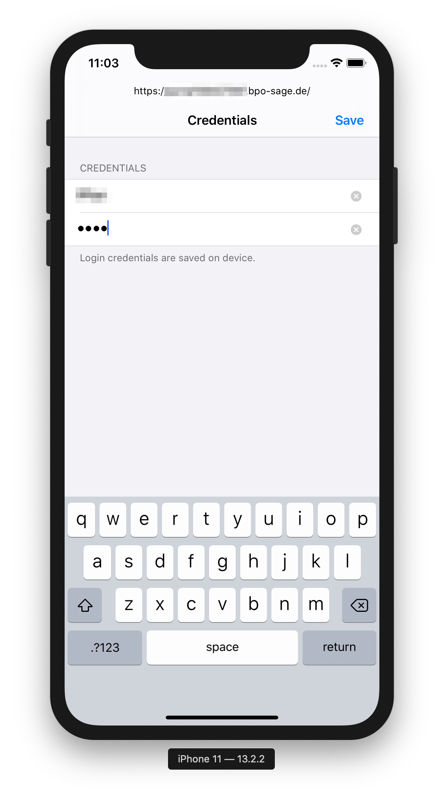

  

# sage9to5

> 📱iOS screen scraper proxy to clock-in / clock-out to Sage HR

## Features

* User Onboarding
* Local Push Notification Feedback
* Local Push Notification Reminder
* Pull to Refresh
* Current Presence Status
* Leave Time Forecast
* Application Settings
  * Credentials
  * Reset Onboarding
  * Preview WebView toggle (debug)

## Screenshots

## Licence

The application is available as open source under the terms of the MIT License.
